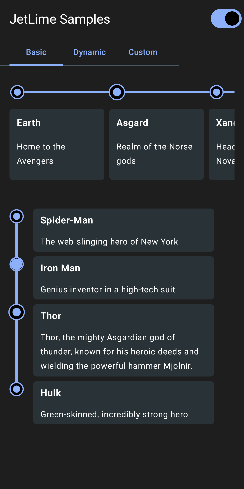

# JetLime 🍋

> A simple yet highly customizable library for showing a TimeLine interface in Jetpack Compose.

[](https://developer.android.com/jetpack/androidx/versions/all-channel)

[](https://search.maven.org/artifact/io.github.pushpalroy/jetlime)


[](https://github.com/pushpalroy/jetlime/blob/master/LICENSE)


[](https://github.com/pushpalroy)
[](https://twitter.com/pushpalroy)

Made with ❤ using Compose

|                 Basic                 |                 Dynamic                 |                 Custom                 |
|:-------------------------------------:|:---------------------------------------:|:--------------------------------------:|
|  |  |  |

## 🚀 Implementation

In `build.gradle` of app module, include the following dependency

```gradle
dependencies {
  implementation("io.github.pushpalroy:jetlime:2.0.0")
}
```

## ✍️ Usage

### 👇 Add items in a Vertical Timeline 

Use the `JetLimeColumn`.

```kotlin
val items = remember { mutableListOf(Item1, Item2, Item3) }

JetLimeColumn(
  modifier = Modifier.padding(16.dp),
  itemsList = ItemsList(items),
  keyExtractor = { item -> item.id },
) { index, item, position ->
  JetLimeEvent(
    style = JetLimeEventDefaults.eventStyle(
      position = position
    ),
  ) {
    // Content here
  }
}
```
### 👉 Add items in a Horizontal Timeline 

Use the `JetLimeRow`.

```kotlin
val items = remember { mutableListOf(Item1, Item2, Item3) }

JetLimeRow(
  modifier = Modifier.padding(16.dp),
  itemsList = ItemsList(items),
  keyExtractor = { item -> item.id },
) { index, item, position ->
  JetLimeEvent(
    style = JetLimeEventDefaults.eventStyle(
      position = position
    ),
  ) {
    // Content here
  }
}
```

### ⚡ Modify `JetLimeColumn` Style

Use the `JetLimeDefaults.columnStyle()`.

```kotlin
JetLimeColumn(
  style = JetLimeDefaults.columnStyle(
    contentDistance = 32.dp,
    itemSpacing = 16.dp,
    lineThickness = 2.dp,
    lineBrush = JetLimeDefaults.lineSolidBrush(color = Color(0xFF2196F3)),
    lineVerticalAlignment = RIGHT,
  ),
) {
  // Code to add events
}
```
### ⚡ Modify `JetLimeRow` Style

Use the `JetLimeDefaults.rowStyle()`.

```kotlin
JetLimeRow(
  style = JetLimeDefaults.rowStyle(
    contentDistance = 32.dp,
    itemSpacing = 16.dp,
    lineThickness = 2.dp,
    lineBrush = JetLimeDefaults.lineSolidBrush(color = Color(0xFF2196F3)),
    lineHorizontalAlignment = BOTTOM,
  ),
) {
  // Code to add events
}
```

### ⚡ Modify `JetLimeEvent` Style

Use the `JetLimeEventDefaults.eventStyle()`.

```kotlin
JetLimeEvent(
  style = JetLimeEventDefaults.eventStyle(
    position = position,
    pointColor = Color(0xFF2889D6),
    pointFillColor = Color(0xFFD5F2FF),
    pointRadius = 14.dp,
    pointAnimation = JetLimeEventDefaults.pointAnimation(),
    pointType = EventPointType.filled(0.8f),
    pointStrokeWidth = 2.dp,
    pointStrokeColor = MaterialTheme.colorScheme.onBackground,
  ),
) {
  // Code to add event content
}
```


### 🎯 JetLimeColumn and JetLimeRow Properties

#### 🌀 Alignment

The timeline line and point circles can be set to either side.

For a `JetLimeColumn` the alignment can be set to `LEFT` or `RIGHT`.

```kotlin
lineVerticalAlignment = LEFT or RIGHT // Default is LEFT
```

For a `JetLimeRow` the alignment can be set to `TOP` or `BOTTOM`.

```kotlin
lineHorizontalAlignment = TOP or BOTTOM // Default is TOP
```

#### 🌀 Line Style

The line can be drawn by passing a `Brush` object to `lineBrush` in a `columnStyle` or `rowStyle`.
Default values can also be used from `JetLimeDefaults` and colors can be modified for quick setup:

```kotlin
lineBrush = JetLimeDefaults.lineGradientBrush()

or

lineBrush = JetLimeDefaults.solidBrush()
```

#### 🌀 Content Distance

The `contentDistance` in `Dp` specifies how far the timeline line should be from the timeline content.

#### 🌀 Item Spacing

The `itemSpacing` in `Dp` specifies the gap between the event items.

#### 🌀 Line Thickness

The `lineThickness` in `Dp` the thickness of the timeline line.


### 🎯 JetLimeEvent Properties

#### 🌀 Position

We always need to pass the position to the `eventStyle` that will be received in the JetLimeColumn lambda.
This is needed so that JetLimeColumn can calculate the position of an event in the list at any time.
Based on the calculation it will assign either of the three `EventPosition`: `START`, `MIDDLE` or `END`.
This classification is needed in order to render correct lines for start and end items.

```kotlin
JetLimeColumn(
  itemsList = ItemsList(items),
  keyExtractor = { item -> item.id },
) { index, item, position ->
  JetLimeEvent(
    style = JetLimeEventDefaults.eventStyle(
      position = position
    ),
  ) {
    // Content here
  }
}
```

#### 🌀 Point Type

The `pointType` of type `EventPointType` specifies the style of the point circle.
It can be any of the three types: `EMPTY`, `FILLED` or `CUSTOM`.

For using `EMPTY`

```kotlin
pointType = EventPointType.EMPTY
```

For using `FILLED`, the `filled()` function has to be used which takes an optional `fillPercent`

```kotlin
pointType = EventPointType.filled(0.8f)
```
For using `CUSTOM`, the `custom()` function has to be used which takes a `icon` of `Painter`.
This can be used to use a custom icon instead of the default types defined.

```kotlin
pointType = EventPointType.custom(icon = painterResource(id = R.drawable.icon_check))
```

#### 🌀 Point Animation

The `pointAnimation` of type `EventPointAnimation` specifies the animation of the point circle.

To enable the default animation

```kotlin
pointAnimation = JetLimeEventDefaults.pointAnimation()
```
To use a custom animation `initialValue`, `targetValue` and `animationSpec` can be passed to `pointAnimation()`.
`animationSpec` should be of the type `InfiniteRepeatableSpec<Float>`.

#### 🌀 Point Color

The `pointColor` is the color of the event point circle background.

#### 🌀 Point Fill Color

The `pointFillColor` is the fill color of the event point circle which is drawn over the `pointColor`.

#### 🌀 Point Radius

The `pointRadius` in `Dp` is the radius of the point circle.

#### 🌀 Point Stroke Width

The `pointStrokeWidth` in `Dp` is the width of the circle border.

#### 🌀 Point Stroke Color

The `pointStrokeColor` is the color of the circle border.


### ☀️ Inspiration

[Timeline-View by Vipul Asri](https://github.com/vipulasri/Timeline-View)

## 🤝 Contribution

Would love to receive contributions! Read [contribution guidelines](CONTRIBUTING.md) for more information regarding contribution.

## 💬 Discuss?

Have any questions, doubts or want to present your opinions, views? You're always welcome. You can [start discussions](https://github.com/pushpalroy/jetlime/discussions).

## 📃 License

```
MIT License

Copyright (c) 2024 Pushpal Roy

Permission is hereby granted, free of charge, to any person obtaining a copy
of this software and associated documentation files (the "Software"), to deal
in the Software without restriction, including without limitation the rights
to use, copy, modify, merge, publish, distribute, sublicense, and/or sell
copies of the Software, and to permit persons to whom the Software is
furnished to do so, subject to the following conditions:

The above copyright notice and this permission notice shall be included in all
copies or substantial portions of the Software.

THE SOFTWARE IS PROVIDED "AS IS", WITHOUT WARRANTY OF ANY KIND, EXPRESS OR
IMPLIED, INCLUDING BUT NOT LIMITED TO THE WARRANTIES OF MERCHANTABILITY,
FITNESS FOR A PARTICULAR PURPOSE AND NONINFRINGEMENT. IN NO EVENT SHALL THE
AUTHORS OR COPYRIGHT HOLDERS BE LIABLE FOR ANY CLAIM, DAMAGES OR OTHER
LIABILITY, WHETHER IN AN ACTION OF CONTRACT, TORT OR OTHERWISE, ARISING FROM,
OUT OF OR IN CONNECTION WITH THE SOFTWARE OR THE USE OR OTHER DEALINGS IN THE
SOFTWARE.
```