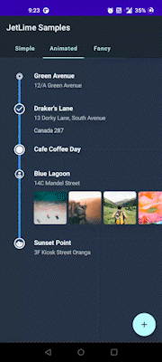
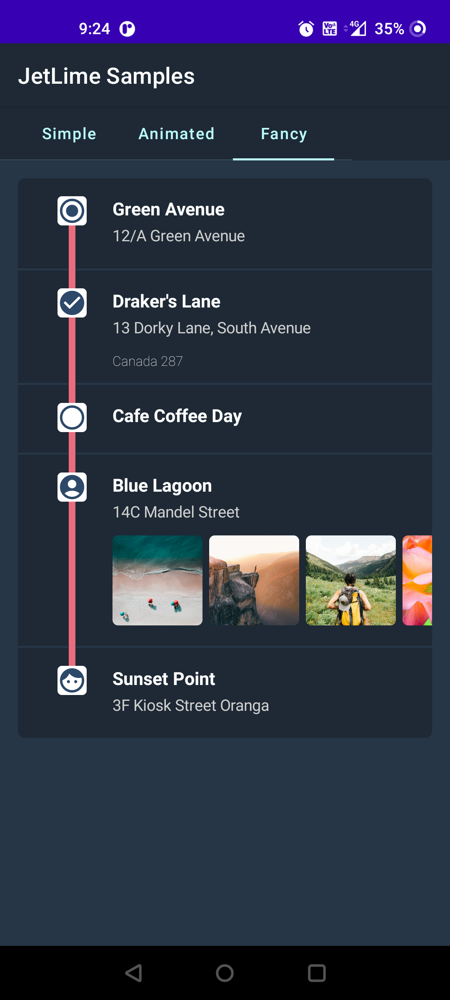
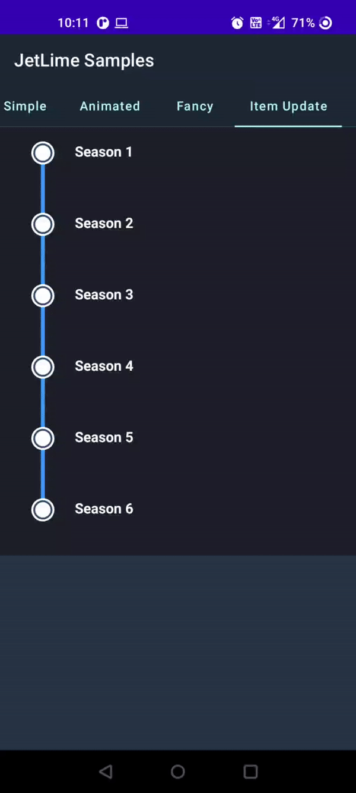

# JetLime ⏱️

> A simple yet highly customizable library for showing a TimeLine view

[](https://developer.android.com/jetpack/androidx/versions/all-channel)
[](https://github.com/pushpalroy/jetlime/blob/master/LICENSE)
[](https://search.maven.org/artifact/io.github.pushpalroy/jetlime)
[](https://github.com/pushpalroy)
[](https://twitter.com/pushpalroy)

#### Made with ❤ using Compose

| Simple | Animated | Fancy | Item Update |
:-------------------------:|:-------------------------: | :-------------------------: | :-------------------------: 
  |   |  | 

## Implementation

In `build.gradle` of app module, include the following dependency

```gradle
dependencies {
  implementation("io.github.pushpalroy:jetlime:1.0.3")
}
```

## Usage

#### ✌🏻 To start using JetLime, use the composable `JetLimeView` like this:

```kotlin
val jetLimeItemsModel = remember {
  JetLimeItemsModel(
    list = mutableStateListOf(
      JetLimeItem(
        title = "Item title",
        description = "Item description",
        jetLimeItemConfig = JetLimeItemConfig(
          itemHeight = 80.dp,
          iconType = IconType.Filled
        )
      )
    )
  )
}

JetLimeView(
  jetLimeItemsModel = jetLimeItemsModel,
  jetLimeViewConfig = JetLimeViewConfig(lineType = LineType.Solid),
  modifier = Modifier.padding(16.dp)
)
```

#### 🤲🏻 Add or remove items to the list:

```kotlin
jetLimeItemsModel.addItem(
  JetLimeItem(
    title = "New Item",
    description = "New item description",
    jetLimeItemConfig = JetLimeItemConfig(iconAnimation = IconAnimation())
  )
)
```

```kotlin
jetLimeItemsModel.removeItem(jetLimeItemsModel.items.lastOrNull())
```

#### 🤘🏻 To customize `JetLimeView` more play around with `JetLimeViewConfig`:

```kotlin
val jetTimeLineViewConfig = JetLimeViewConfig(
  backgroundColor = Color(0xFF747474),
  lineColor = Color(0xff00ACEE),
  lineThickness = 12F,
  lineType = LineType.Solid,
  lineStartMargin = 48.dp,
  lineEndMargin = 36.dp,
  iconSize = 26.dp,
  iconShape = CircleShape,
  iconBorderThickness = 2.dp,
  itemSpacing = 0.dp,
  showIcons = true
)
```

#### 👌🏻 To customize each item of the view configure `JetLimeItemConfig` for each item:

```kotlin
val jetLimeItemConfig = JetLimeItemConfig(
  titleColor = Color(0xFF2C2C2C),
  descriptionColor = Color(0xFF3A3A3A),
  iconType = IconType.Checked,
  iconColor = Color(0xFF3F51B5),
  iconBorderColor = Color(0xFFFFFFFF),
  iconBackgroundColor = Color(0xFF44485F),
  itemHeight = 60.dp
)
```

#### 😲 Custom animations can be done for each item icon using `iconAnimation`:

```kotlin
  val jetLimeItemConfig = JetLimeItemConfig(
  iconAnimation = IconAnimation(
    initialValue = 0.5f,
    targetValue = 1.5f,
    keySpecs = keyframes {
      durationMillis = 500
      0.6f at 0
      0.7f at 100
      0.8f at 200
      0.9f at 300
      1f at 500
    }
  )
)
```

#### 😱 Apart from `title` and `description` you can pass any composable to `JetLimeItem`:

```kotlin
JetLimeItem(
  title = "Some Title",
  description = "Some Description"
) {
  // Pass any composable here
}
```

#### 🤪 Use custom icon of `ImageVector` type for each item:

```kotlin
iconType = IconType.Custom(Icons.Rounded.AccountCircle)
```

<hr>

#### 🙏 Got inspired by:

[Timeline-View by Vipul Asri](https://github.com/vipulasri/Timeline-View)

### License

```
MIT License

Copyright (c) 2022 Pushpal Roy

Permission is hereby granted, free of charge, to any person obtaining a copy
of this software and associated documentation files (the "Software"), to deal
in the Software without restriction, including without limitation the rights
to use, copy, modify, merge, publish, distribute, sublicense, and/or sell
copies of the Software, and to permit persons to whom the Software is
furnished to do so, subject to the following conditions:

The above copyright notice and this permission notice shall be included in all
copies or substantial portions of the Software.

THE SOFTWARE IS PROVIDED "AS IS", WITHOUT WARRANTY OF ANY KIND, EXPRESS OR
IMPLIED, INCLUDING BUT NOT LIMITED TO THE WARRANTIES OF MERCHANTABILITY,
FITNESS FOR A PARTICULAR PURPOSE AND NONINFRINGEMENT. IN NO EVENT SHALL THE
AUTHORS OR COPYRIGHT HOLDERS BE LIABLE FOR ANY CLAIM, DAMAGES OR OTHER
LIABILITY, WHETHER IN AN ACTION OF CONTRACT, TORT OR OTHERWISE, ARISING FROM,
OUT OF OR IN CONNECTION WITH THE SOFTWARE OR THE USE OR OTHER DEALINGS IN THE
SOFTWARE.
```